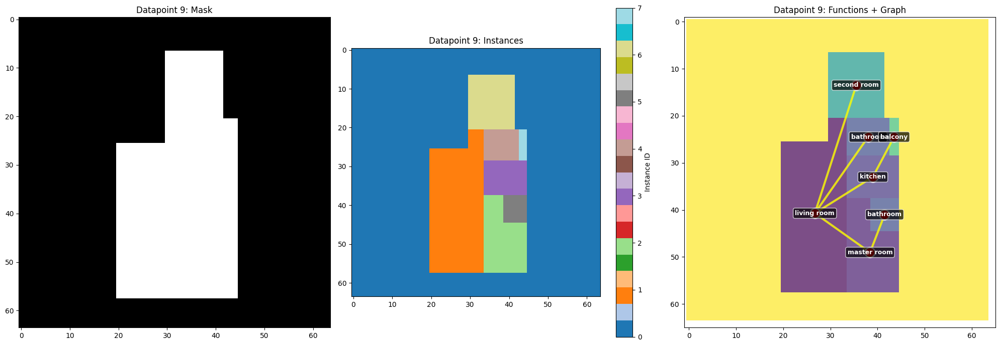
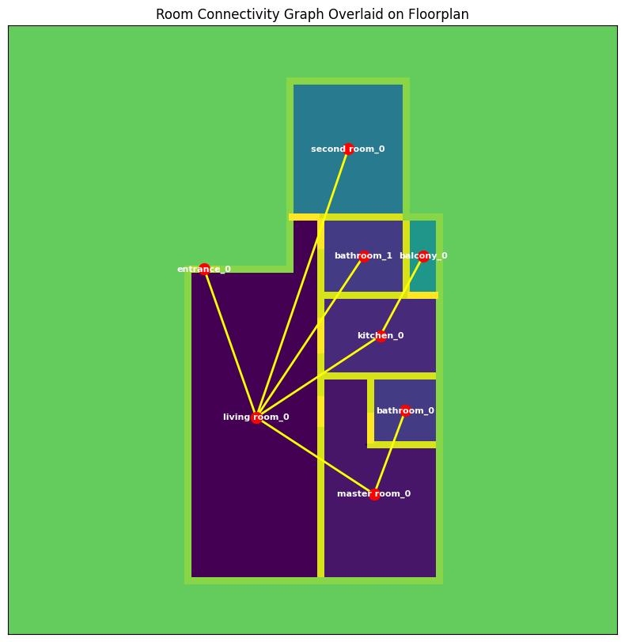

# Basic set of functions to extract data from the rPlan dataset

## Description

A repo to export additional data from the rPlan dataset.
There are functionalities to down-size the images while removing the wall and extracting the connectivity graph of the plans.
Additionally an LLM can be used to create natural language descriptions for the plans.

There can also be run additional qualitative analysis based on common space syntax metrics based this [python package](https://pypi.org/project/FloorplanAnalytics/) and be added to the datapoint descriptions.

## Installation

Pull the repo and navigate to the cloned local directory.

Initialize a virtual environment

```bash
python -m venv venv
```

activate it

```bash
./venv/Scripts/Activate.ps1
```

and install the requirements

```Python
pip install -r requirements.txt
```

You need to download the rPlan dataset from [this link](https://docs.google.com/forms/d/e/1FAIpQLSfwteilXzURRKDI5QopWCyOGkeb_CFFbRwtQ0SOPhEg0KGSfw/viewform) to use this repo.

Also you need to add a .env file with your OPENAI_API_KEY variable for connect to your OpenAI API.

After the code is ready to use for additional extraction.

## Example run for basic plan extraction

Test run with the first 10 plans:

```bash
python run_full_extraction.py --data_path D:/Datasets/rPlan/dataset/floorplan_dataset --output_path ./output --max_index 10 --model gpt-4 --list_models
```

## Implemented

- Extract the connectivity graph
- Extract the count of each room type
- Extract extract the single layers
- Resize and a grid base ignoring walls and doors
- Let an LLM via langchain api write descriptions of the plans based on the extracted conntectivity graph

## To Do

- ~~Extract room sizes~~
- Add entrance to the graph
- Add room sizes and entrance to LLM description

- Add FloorplanAnalytics to the plans to enrich the dataset
... continue ...

## Links

- https://www.mi-research.net/en/supplement/42782fb4-f4cf-4873-a92b-d0ac89d10e27
- http://staff.ustc.edu.cn/~fuxm/projects/DeepLayout/index.html

rPlan:
- https://docs.google.com/forms/d/e/1FAIpQLSfwteilXzURRKDI5QopWCyOGkeb_CFFbRwtQ0SOPhEg0KGSfw/viewform

Other Datatset:
- https://github.com/gesstalt/ROBIN

## Examples

Visualization from an extracted datapoint downsized to 64x64

The connection graph extraction

